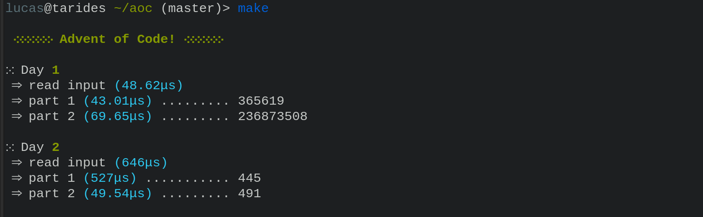

# My solutions for AOC and a re-usable helper

Solutions are in `solutions/`, helper in `lib/`. The helper makes some 
pretty-printing and benchmarking of solutions run-time, as well as 
fetching input for you. To use it you need to find your AOC token:

> Firefox: "Storage" tab, Cookies, and copy the "Value" field of the session cookie.
> Google Chrome / Chromium: "Application" tab, Cookies, and copy the "Value" field of the session cookie.

Thank you @remi-dupre for the inspiration: https://github.com/remi-dupre/aoc
